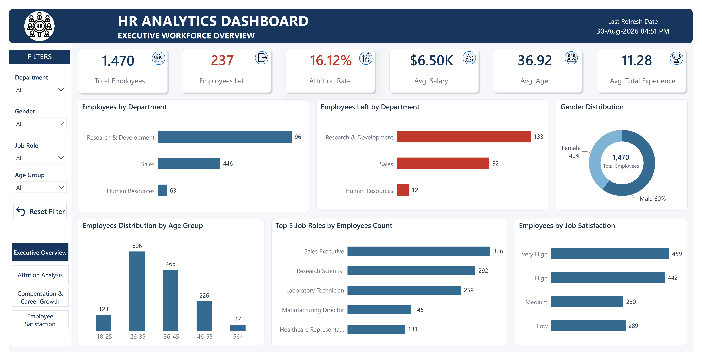
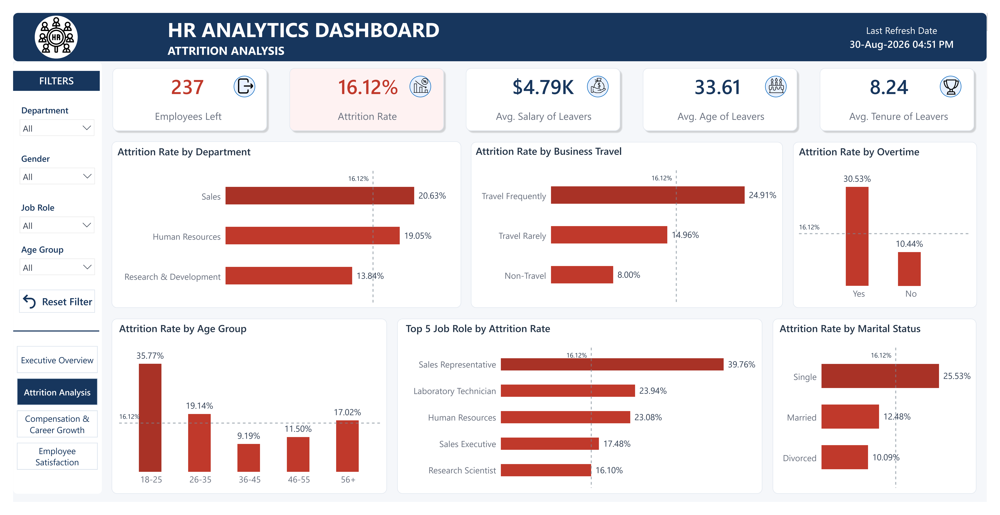
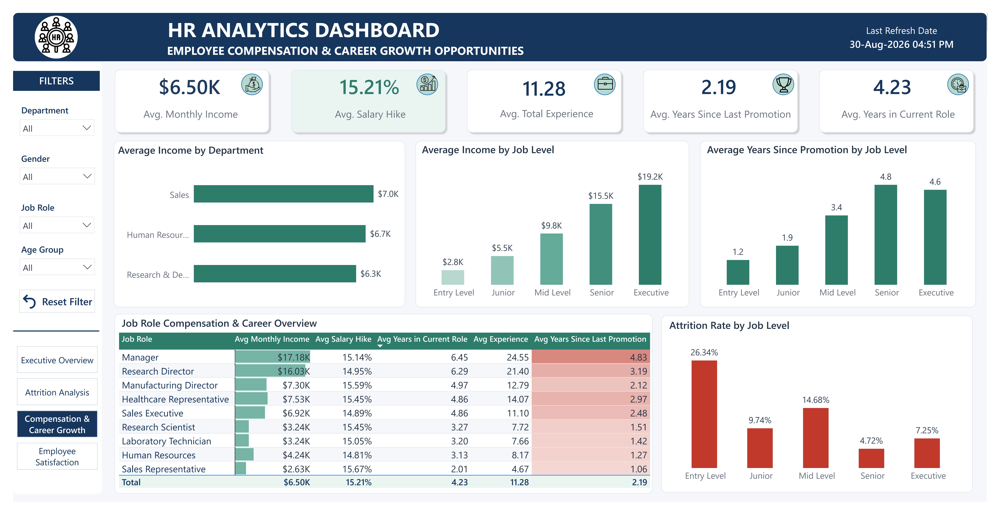
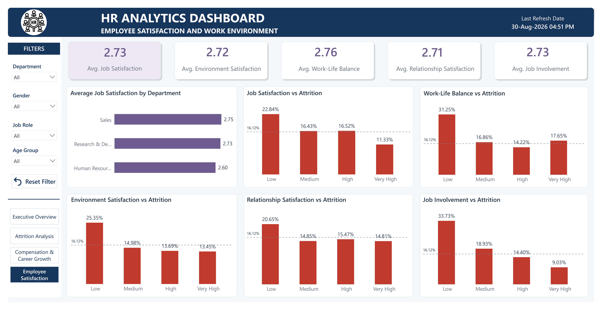

# 📊 HR Analytics — Employee Attrition & Workforce Analysis

## 📌 Project Overview

This is an end-to-end HR Data Analytics project focused on understanding employee attrition, compensation, workload, satisfaction, career growth, and other workforce factors.

The project follows a complete analytics workflow:

**Python → Data Cleaning & EDA → MySQL → SQL Analysis → Power BI → Dashboard & Insights**

The objective is to transform raw HR data into meaningful business insights that can help identify employee groups with higher attrition and understand how workload, compensation, satisfaction, career growth, and personal factors relate to employee turnover.

---

## 🎯 Business Objectives

The analysis focuses on answering questions such as:

- What is the overall employee attrition rate?
- Which departments have the highest attrition?
- Which job roles have higher employee turnover?
- Does overtime relate to employee attrition?
- Does business travel relate to attrition?
- How does compensation relate to employee turnover?
- Does salary growth differ across departments and job levels?
- Which job levels have longer promotion gaps?
- How do satisfaction levels relate to attrition?
- Does work-life balance relate to employee turnover?
- Are certain age groups or marital-status groups more likely to leave?
- Which employee groups may require further HR attention?

---

## 🗂️ Dataset

The dataset contains employee-level HR information covering demographics, compensation, job characteristics, satisfaction, workload, career progression, and attrition.

### Main Categories

| Category | Variables |
|---|---|
| Demographics | Age, Gender, MaritalStatus, Education, EducationField |
| Job Information | Department, JobRole, JobLevel, BusinessTravel, OverTime |
| Compensation | DailyRate, HourlyRate, MonthlyIncome, MonthlyRate, PercentSalaryHike, StockOptionLevel |
| Satisfaction | JobSatisfaction, EnvironmentSatisfaction, RelationshipSatisfaction, WorkLifeBalance, JobInvolvement |
| Experience | TotalWorkingYears, YearsAtCompany, YearsInCurrentRole, YearsSinceLastPromotion, YearsWithCurrManager, NumCompaniesWorked |
| Attrition | Attrition |
| Other | DistanceFromHome, PerformanceRating, TrainingTimesLastYear |

---

## 🛠️ Tools & Technologies

### Python
- Pandas
- NumPy
- Matplotlib
- Jupyter Notebook

### MySQL / SQL
- MySQL
- CTEs
- Window Functions
- CASE Statements
- GROUP BY
- HAVING
- Aggregate Functions
- Subqueries
- Conditional Aggregation
- Ranking

### Power BI
- Power Query
- DAX
- Calculated Columns
- Measures
- KPI Cards
- Bar Charts
- Column Charts
- Donut Chart
- Tables
- Conditional Formatting
- Data Bars
- Reference Lines
- Interactive Slicers
- Page Navigation

---

# 🔄 Project Workflow

**Raw HR Dataset**

↓

**Python Data Cleaning & Validation**

↓

**Exploratory Data Analysis**

↓

**Save Clean Dataset**

↓

**MySQL Database**

↓

**SQL Business Analysis**

↓

**SQL Insights**

↓

**Power BI**

↓

**DAX Measures & Calculated Columns**

↓

**4-Page Interactive Dashboard**

↓

**Business Insights**

---

# 🐍 1. Data Cleaning & Exploratory Data Analysis — Python

The raw HR dataset was first imported into Jupyter Notebook using Pandas.

### Data Inspection

Performed basic inspection of the dataset including:

- Number of rows and columns
- Data types
- Statistical summary
- Missing-value analysis
- Duplicate-value analysis
- Unique-value checks
- Categorical value validation
- Numerical variable inspection

### Data Quality & Validation

Performed validation checks to identify invalid or inconsistent records.

#### Logical consistency check

Checked whether:

`YearsAtCompany <= TotalWorkingYears`

This ensures that an employee's tenure at the current company does not exceed their total working experience.

Other validation checks included:

- Negative age values
- Negative salary values
- Zero salary values
- Invalid numerical values
- Inconsistent categorical values
- Unexpected category values

No significant data-quality issues were identified after validation.

### Data Standardization

Column names were converted from CamelCase to snake_case for consistency.

Examples:

- `MonthlyIncome` → `monthly_income`
- `YearsAtCompany` → `years_at_company`
- `JobSatisfaction` → `job_satisfaction`

The following columns were removed because they did not contribute meaningfully to the analysis:

- `employee_count`
- `over_18`
- `standard_hours`

---

# 📈 2. Exploratory Data Analysis — Python

After cleaning, exploratory analysis was performed to understand the structure, distribution, and relationships within the dataset.

### Target Variable Analysis

Analyzed:

- Attrition count
- Attrition percentage
- Employees who stayed
- Employees who left

### Numerical Variable Analysis

Histograms were created for numerical variables to inspect:

- Data distributions
- Potential outliers
- Unusual values
- Data ranges
- Skewness

### Categorical Variable Analysis

Used `value_counts()` and visualizations to analyze categorical variables.

Examples:

- Employees by Department
- Employees by Gender
- Employees by Job Role
- Employees by Business Travel
- Employees by Marital Status
- Employees by Job Level

### Correlation Analysis

Created a correlation matrix to examine relationships between numerical variables such as:

- Age
- Monthly Income
- Total Working Years
- Years at Company
- Years in Current Role
- Years Since Last Promotion
- Job Satisfaction
- Work-Life Balance

---

# 🔎 3. Business Analysis — Python

Business-focused analysis was performed using grouping and aggregation techniques.

### Attrition Analysis

Analyzed attrition by:

- Department
- Gender
- Job Role
- Job Level
- Overtime
- Business Travel
- Age Group
- Marital Status
- Satisfaction Levels

### Grouped Analysis

Calculated metrics such as:

- Employee count by department
- Employee count by job role
- Average salary by department
- Average salary by job role
- Average salary by job level
- Average experience
- Average tenure
- Average satisfaction

### Top Employee Analysis

Identified:

- Top 10 employees by salary
- Top 10 employees by total experience
- Other high-value employee groups

The cleaned dataset was saved as:

**`hr_clean.csv`**

---

# 🗄️ 4. MySQL Database Setup

After completing the Python analysis, the cleaned dataset was imported into MySQL.

A database was created:

`hr_analytics`

The cleaned `hr_clean.csv` dataset was then imported into MySQL using the MySQL import/export functionality.

---

# 📊 5. SQL Business Analysis

SQL was used to perform structured business analysis on the cleaned HR dataset.

### Data Overview

Analyzed:

- Total employees
- Departments
- Job roles
- Job levels
- Employee demographics
- Workforce distribution

### KPI Analysis

Calculated:

- Total Employees
- Average Age
- Average Monthly Income
- Employees Who Left
- Attrition Rate
- Average Total Experience
- Average Company Tenure

---

## 🔴 Attrition Analysis

Analyzed employee attrition across:

- Department
- Job Role
- Job Level
- Gender
- Age Group
- Marital Status
- Overtime
- Business Travel

This helped identify employee segments with comparatively higher attrition.

---

## 💰 Compensation Analysis

Analyzed compensation-related factors including:

- Salary Hike vs Attrition
- Stock Option Level vs Attrition
- Average Salary by Department
- Average Salary by Job Role
- Average Salary by Job Level

---

## ⚙️ Workload Analysis

Analyzed:

- Overtime vs Attrition
- Business Travel vs Attrition

This helped evaluate whether workload and travel requirements were associated with employee turnover.

---

## 😊 Satisfaction Analysis

Analyzed the relationship between employee satisfaction and attrition across:

- Job Satisfaction
- Environment Satisfaction
- Relationship Satisfaction
- Work-Life Balance

---

## 📈 Career Growth Analysis

Analyzed career progression using:

- Job Involvement vs Attrition
- Job Role vs Years Since Last Promotion
- Job Level vs Years Since Last Promotion
- Years in Current Role
- Total Working Experience

---

## 👥 Personal Factor Analysis

Analyzed attrition across:

- Marital Status
- Age
- Gender
- Education
- Education Field

---

## 🧠 SQL Concepts Used

The SQL analysis involved:

- SELECT
- WHERE
- GROUP BY
- HAVING
- ORDER BY
- CASE Statements
- Aggregate Functions
- CTEs
- Window Functions
- Subqueries
- Conditional Aggregation
- Ranking
- Filtering
- Calculated Metrics

---

# 💡 SQL Insights

A separate SQL file was created to document the major findings and business insights obtained from the analysis.

The insights focus on:

- High-attrition departments
- High-attrition job roles
- Overtime and attrition
- Business travel and attrition
- Satisfaction and attrition
- Career growth
- Compensation
- Demographic patterns

---

# 📊 6. Power BI Dashboard

The cleaned HR dataset was imported into Power BI from MySQL.

DAX was used to create analytical measures and calculated columns.

## Key DAX Measures

Created measures for:

- Total Employees
- Average Age
- Average Monthly Income
- Average Experience
- Employees Who Left
- Attrition Rate
- Average Years Since Last Promotion
- Average Age of Employees Who Left
- Average Environment Satisfaction
- Average Salary Hike
- Average Company Tenure
- Average Job Satisfaction
- Average Work-Life Balance
- Average Relationship Satisfaction
- Average Job Involvement

## Calculated Columns

Created calculated columns to convert numerical values into meaningful business categories.

Examples:

- Age Group
- Environment Satisfaction Level
- Job Satisfaction Level
- Job Involvement Level
- Work-Life Balance Level
- Relationship Satisfaction Level

Satisfaction ratings were converted into meaningful categories:

| Rating | Level |
|---:|---|
| 1 | Low |
| 2 | Medium |
| 3 | High |
| 4 | Very High |

These categories made the numerical ratings easier to interpret in Power BI visualizations.

---

# 📑 7. Power BI Dashboard Pages

The final Power BI report contains **4 interactive dashboard pages**.

---

## 🏠 Page 1 — Executive Overview

Provides a high-level overview of the workforce.

### KPIs

- Total Employees
- Average Age
- Average Monthly Income
- Employees Who Left
- Attrition Rate
- Average Total Experience
- Average Company Tenure

### Visuals

- Employees by Department
- Employees Left by Department
- Employees by Gender
- Employees by Age Group
- Top 5 Job Roles by Employee Count
- Employees by Job Satisfaction

---

## 🔴 Page 2 — Attrition Analysis

Focuses on identifying employee groups with higher attrition.

### KPIs

- Employees Left
- Attrition Rate
- Average Salary of Leavers
- Average Age of Leavers
- Average Tenure of Leavers

### Visuals

- Attrition Rate by Department
- Attrition Rate by Job Role
- Attrition Rate by Marital Status
- Attrition Rate by Age Group
- Attrition Rate by Overtime
- Attrition Rate by Business Travel

A **16.12% company-wide attrition benchmark** is used as a reference line to compare category-level attrition rates.

---

## 🟢 Page 3 — Compensation & Career Growth

Focuses on employee compensation and career progression.

### KPIs

- Average Monthly Income
- Average Salary Hike
- Average Total Experience
- Average Years Since Last Promotion
- Average Years in Current Role

### Visuals

- Average Monthly Income by Department
- Average Monthly Income by Job Level
- Average Years Since Last Promotion by Job Level
- Average Years in Current Role by Job Level
- Attrition Rate by Job Level
- Job Role Compensation & Career Overview Table

The table provides job-role-level information including:

- Average Monthly Income
- Average Salary Hike
- Average Experience
- Average Years in Current Role
- Average Years Since Last Promotion

---

## 🟣 Page 4 — Employee Satisfaction

Focuses on employee experience and satisfaction-related factors.

### KPIs

- Average Job Satisfaction
- Average Environment Satisfaction
- Average Work-Life Balance
- Average Relationship Satisfaction
- Average Job Involvement

### Visuals

- Average Job Satisfaction by Department
- Job Satisfaction vs Attrition
- Work-Life Balance vs Attrition
- Environment Satisfaction vs Attrition
- Relationship Satisfaction vs Attrition
- Job Involvement vs Attrition

A **16.12% company-wide attrition benchmark** is used to compare attrition rates across satisfaction categories.

---

# 🎨 Dashboard Design

A consistent visual design system was applied across all four pages.

### Page Themes

| Dashboard Page | Primary Color |
|---|---|
| Executive Overview | Blue |
| Attrition Analysis | Red |
| Compensation & Career Growth | Teal |
| Employee Satisfaction | Purple |

### Common Design Elements

- Consistent navigation
- Interactive slicers
- KPI cards
- Reference lines
- Conditional formatting
- Data bars
- Consistent typography
- Clean white visual cards
- Light dashboard background
- Page-specific accent colors
- Interactive page navigation


# 📸 Dashboard Preview

### 🏠 Executive Overview



### 🔴 Attrition Analysis



### 🟢 Compensation & Career Growth



### 🟣 Employee Satisfaction




---

# 📌 Key Business Insights

The analysis identified several patterns worth further investigation:

- Certain departments and job roles show higher-than-average attrition.
- Employees working overtime have substantially higher attrition than employees who do not work overtime.
- Some age groups show considerably higher attrition than the company-wide rate.
- Frequent business travel is associated with higher employee attrition.
- Lower satisfaction levels are associated with higher attrition across several satisfaction dimensions.
- Career progression indicators such as years since last promotion vary across job levels and job roles.
- Compensation and salary growth vary significantly across departments, job roles, and job levels.
- Some employee groups show both higher attrition and potentially unfavorable career-growth indicators, making them useful areas for further HR investigation.

> **Note:** These findings represent patterns and associations in the dataset and should not automatically be interpreted as causal relationships.

---


# 🎯 Recommendations

Based on the analysis, the following recommendations can help HR teams investigate and address potential attrition risks:

### 1. Focus on High-Attrition Departments and Job Roles
Prioritize departments and job roles with attrition rates above the company-wide benchmark of 16.12%.

- Conduct targeted employee feedback surveys
- Identify role-specific challenges
- Review workload, compensation, and career-growth opportunities

### 2. Review Overtime and Workload
Employees working overtime show substantially higher attrition than employees who do not work overtime.

- Review workload distribution
- Monitor excessive overtime
- Consider additional staffing where required
- Introduce workload and burnout monitoring

### 3. Strengthen Career Growth Opportunities
Employees with longer periods since their last promotion may require additional career-growth attention.

- Establish clearer promotion criteria
- Conduct regular career discussions
- Provide internal mobility opportunities
- Create structured career-development plans

### 4. Improve Employee Satisfaction
Lower satisfaction levels are associated with higher attrition across several satisfaction dimensions.

HR teams can:

- Conduct employee engagement surveys
- Identify department-specific satisfaction issues
- Improve manager-employee communication
- Strengthen recognition and feedback programs

### 5. Review Compensation and Salary Growth
Analyze compensation differences across departments, job roles, and job levels.

- Review salary competitiveness
- Monitor salary-hike patterns
- Identify roles with compensation gaps
- Align compensation with responsibilities and experience

### 6. Monitor High-Risk Employee Segments
Use the dashboard to regularly monitor employee groups with higher-than-average attrition.

Focus on combinations of:

- Overtime
- Job role
- Job level
- Satisfaction
- Age group
- Business travel
- Career progression

### 7. Use Data-Driven HR Monitoring
HR teams can use the dashboard as a recurring monitoring tool to identify changes in attrition and employee experience over time.

> These recommendations are based on observed patterns and associations in the dataset and should be validated with additional employee-level and organizational context before implementing HR policies.

# 📁 Project Structure

```text
HR-Analytics/
│
├── data/
│   └── hr_clean.csv
│
├── python/
│   └── hr_analysis.ipynb
│
├── sql/
│   ├── hr_analysis.sql
│   └── hr_insights.sql
│
├── powerbi/
│   └── HR_Analytics_Dashboard.pbix
│
├── screenshots/
│   ├── executive_overview.png
│   ├── attrition_analysis.png
│   ├── compensation_career.png
│   └── employee_satisfaction.png
│
└── README.md

## 📌 Conclusion

This project demonstrates a complete end-to-end Data Analytics workflow, starting from raw HR data and progressing through data cleaning, exploratory analysis, SQL-based business analysis, DAX modeling, and interactive Power BI dashboard development.

The final dashboard provides a structured view of:

**Workforce → Attrition → Compensation → Workload → Satisfaction → Career Growth**

and highlights employee segments and factors that may require further investigation.

---

### 👨‍💻 Project Workflow

**Python → MySQL → SQL → Power BI → Business Insights**

---

⭐ If you found this project useful, feel free to star the repository!

**Built with Python • MySQL • SQL • Power BI**
